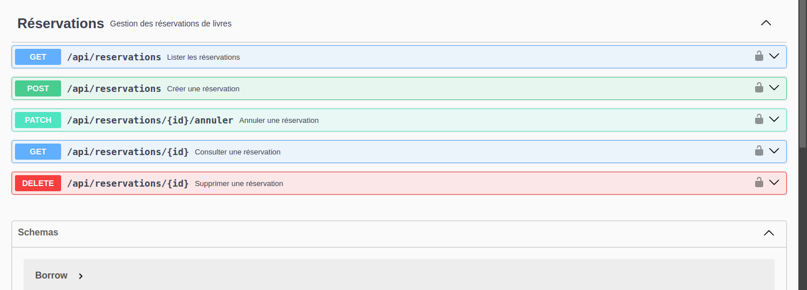

<h1 align="center">
    <br>
    Bibliothèque
    <br>
</h1>

[]()
[]()
[]()
[]()
[]()
[]()

Application full-stack de gestion de bibliothèque : **Spring Boot 3.2** (API REST, Java 17) +
**Angular 17** (interface) + **PostgreSQL 16** (persistance), orchestrés avec **Docker Compose**.

* Deux profils : **Admin** (CRUD livres et utilisateurs) et **User** (emprunter / rendre / réserver).
* Authentification par **JWT**, mots de passe chiffrés avec **BCrypt**.
* Redirection vers une page *forbidden* si le rôle n'a pas accès à l'URL.
* Module **Réservation** : un adhérent réserve un livre indisponible et est notifié à son retour.

---

## Sommaire

1. [Prérequis](#1-prérequis)
2. [État du projet](#2-état-du-projet)
3. [Arborescence](#3-arborescence)
4. [Démarrer le projet](#4-démarrer-le-projet)
5. [Comptes de test](#5-comptes-de-test)
6. [Le trajet d'une donnée : du clic à la base](#6-le-trajet-dune-donnée--du-clic-à-la-base)
7. [Les API](#7-les-api)
8. [Rappel Git](#8-rappel-git)
9. [Captures d'écran](#9-captures-décran)

---

## 1. Prérequis

| Outil | Version | Vérifier avec |
|---|---|---|
| JDK | 17 ou + | `java -version` |
| Node.js | 20 ou + | `node -v` |
| npm | fourni avec Node | `npm -v` |
| Docker Desktop | à jour, **démarré** | `docker -v` puis `docker compose version` |
| Git | quelconque | `git --version` |
| IDE | IntelliJ IDEA / VS Code | — |

---

## 2. État du projet

Le projet a été migré depuis son état d'origine (MySQL, Spring Boot 2.4.5, Angular 14,
sans Docker) vers la stack actuelle, et le module **Réservation** a été ajouté par-dessus.

### Backend (`bibliotheque-backend/`)

* CRUD Livres (`/admin/books`), Utilisateurs (`/admin/users`), Emprunts (`/borrow`),
  authentification JWT (`/authenticate`).
* Module **Réservation** (`/api/reservations`) : 5 endpoints, 6 règles de gestion (RG-01 à
  RG-06), validation, DTO d'entrée et de sortie, gestion d'erreurs 400/404/409, documentation
  Swagger complète, 23 tests unitaires couvrant chaque règle dans les deux sens.
* Base **PostgreSQL 16**, schéma et données de démarrage créés automatiquement au premier
  lancement (`init-scripts/`).

### Frontend (`bibliotheque-frontend/`)

* Un module par fonctionnalité : `books/`, `borrow/`, `users/`, `reservation/` — chacun avec
  ses composants et son service HTTP dédié.
* Écran Réservations : liste filtrable par statut, formulaire de création (listes déroulantes
  alimentées par l'API), annulation avec confirmation, gestion complète des 4 états
  (chargement / rempli / vide / erreur) et des refus métier (400/404/409) affichés avec le
  message du serveur.
* Composants partagés (`_shared/`) : bouton, badge, select, dialogue de confirmation,
  squelette de chargement, état de tableau générique.

### Ce qui reste en amélioration continue

* Endpoint dédié "réservations expirées" et bascule automatique en `EXPIREE` par tâche
  planifiée (actuellement, `EXPIREE` est un statut manuel/à filtrer via `?status=EXPIREE`).

---

## 3. Arborescence

```
bibliotheque/
├── bibliotheque-backend/                 API REST Spring Boot 3.2 (Java 17) — port 8080
│   ├── pom.xml
│   ├── mvnw, mvnw.cmd                    wrapper Maven
│   └── src/
│       ├── main/java/com/ibizabroker/bibliotheque/
│       │   ├── BibliothequeApplication.java
│       │   ├── entity/                   objets métier + DTO (même dossier, convention du projet)
│       │   │   ├── Books.java, Users.java, Role.java, Borrow.java
│       │   │   ├── Reservation.java            l'entité (jamais exposée telle quelle)
│       │   │   ├── ReservationRequest.java     DTO d'entrée (bookId, adherentId)
│       │   │   ├── ReservationResponse.java    DTO de sortie (titre livre, nom adhérent inclus)
│       │   │   ├── ReservationStatus.java      enum EN_ATTENTE/DISPONIBLE/ANNULEE/EXPIREE/HONOREE
│       │   │   └── JwtRequest.java, JwtResponse.java, JsonDataSerializer.java
│       │   ├── dao/                      Spring Data JPA
│       │   │   ├── BooksRepository.java, UsersRepository.java, BorrowRepository.java
│       │   │   └── ReservationRepository.java
│       │   ├── controller/
│       │   │   ├── BooksController.java        /admin/books
│       │   │   ├── AdminController.java        /admin/users
│       │   │   ├── BorrowController.java       /borrow
│       │   │   ├── ReservationController.java  /api/reservations
│       │   │   └── JwtController.java          /authenticate
│       │   ├── service/ (+ service/impl/)
│       │   │   ├── JwtService.java
│       │   │   └── IReservationService.java / ReservationServiceImpl.java
│       │   ├── configuration/            sécurité JWT, CORS, OpenAPI/Swagger
│       │   ├── exceptions/               NotFoundException, ConflictException, GlobalExceptionHandler
│       │   └── util/JwtUtil.java
│       ├── main/resources/
│       │   ├── application.properties           profil local (PostgreSQL sur localhost)
│       │   └── application-docker.properties     profil "docker" (utilisé par docker compose)
│       └── test/java/.../ReservationServiceUnitTest.java   23 tests, RG-01 à RG-06
│
├── bibliotheque-frontend/                Angular 17 — port 4200
│   ├── package.json, angular.json
│   └── src/app/
│       ├── app-routing.module.ts         URL -> module, + rôles autorisés
│       ├── _core/services/               api-base.service.ts (URL API), error-handler.service.ts
│       ├── _auth/                        auth.guard.ts, auth.interceptor.ts
│       ├── _model/                       types TypeScript (books, users, borrow, reservation)
│       ├── _shared/                      composants réutilisables (button, badge, select,
│       │                                 confirm-dialog, skeleton, table-state)
│       ├── header/, topbar/              navigation (sidebar + barre du haut)
│       ├── books/, borrow/, users/       un dossier par fonctionnalité : components/ + services/
│       └── reservation/                  module Réservation
│           ├── components/
│           │   ├── reservation-container/    état + appels API (conteneur)
│           │   ├── reservation-list/         tableau, filtre, annulation
│           │   └── reservation-form/         formulaire de création (modale)
│           └── services/reservation.service.ts, reservation-data.service.ts
│
├── init-scripts/                         SQL exécuté au premier démarrage de Postgres
│   ├── 01-init.sql                       schéma + rôles + compte admin
│   ├── 02-reservation.sql                table reservation
│   └── 03-reservation-testdata.sql       livres/réservations de démonstration
├── docker-compose.yml                    postgres + backend + frontend + adminer
├── docker-compose.override.yml           surcharge dev (hot-reload frontend)
├── screenshots/, docs/screenshots/       captures utilisées plus bas
├── SEANCE-1.md, SEANCE-2.md, SEANCE-3.md déroulé de chaque séance
└── README.md
```

**La règle à retenir** : côté backend, un dossier = une responsabilité (`controller` reçoit,
`service` décide, `dao` persiste, `entity` représente — les DTO vivent dans `entity/` par
convention du projet). Côté frontend, un dossier = une fonctionnalité, et tout ce qui parle au
réseau passe par un `service` dédié, jamais par un appel direct dans un composant.

---

## 4. Démarrer le projet

### 4.1 Avec Docker Compose (recommandé)

Depuis `bibliotheque/` :

```bash
docker compose up -d --build
```

Ça lance, dans l'ordre (grâce aux `healthcheck`) :

| Service | URL | Détail |
|---|---|---|
| PostgreSQL | `localhost:5434` | `bibliotheque` / `postgres` / `postgres` — schéma et compte admin créés automatiquement (`init-scripts/`) |
| Backend | http://localhost:8080 | Swagger : `/swagger-ui.html` · santé : `/actuator/health` |
| Frontend | http://localhost:4200 | hot-reload activé via `docker-compose.override.yml` |
| Adminer | http://localhost:8090 | interface web pour consulter la base |

```bash
docker compose logs -f backend     # suivre les logs d'un service
docker compose down                # arrêter et supprimer les conteneurs
docker compose down -v             # + réinitialiser la base (supprime le volume)
```

### 4.2 En local, sans Docker

```bash
# 1. PostgreSQL doit tourner sur localhost:5432, base "bibliotheque",
#    utilisateur/mot de passe "postgres"/"postgres" (voir application.properties)

# 2. Backend
cd bibliotheque-backend
./mvnw spring-boot:run          # Windows : mvnw.cmd spring-boot:run
# Tests : ./mvnw test — nécessite Docker (Testcontainers)

# 3. Frontend
cd bibliotheque-frontend
npm install
npm start                       # équivaut à : ng serve
```

L'API écoute sur **http://localhost:8080**, l'interface sur **http://localhost:4200**.
Sans Docker, le schéma n'est pas créé automatiquement : `spring.jpa.hibernate.ddl-auto=update`
le fait au démarrage, mais il faut alors insérer les données de départ à la main
(voir `init-scripts/01-init.sql` pour le modèle SQL à rejouer).

---

## 5. Comptes de test

Avec Docker Compose, un compte administrateur est créé automatiquement au premier démarrage
(`init-scripts/01-init.sql`) :

**admin / admin123**

Vérification en ligne de commande :

```bash
curl -X POST http://localhost:8080/authenticate \
     -H "Content-Type: application/json" \
     -d '{"username":"admin","password":"admin123"}'
```

Vous devez recevoir un JSON contenant `jwtToken`. Gardez-le : il sert pour tous les autres
appels (`Authorization: Bearer <token>`).

---

## 6. Le trajet d'une donnée : du clic à la base

Prenons **la création d'une réservation** — le module le plus récent — et suivons-la couche
par couche.

| # | Où | Fichier | Ce qui se passe |
|---|---|---|---|
| 1 | Navigateur | [`reservation-form.component.html`](bibliotheque-frontend/src/app/reservation/components/reservation-form/reservation-form.component.html) | L'utilisateur choisit un livre et un adhérent dans deux listes déroulantes alimentées par l'API (pas de saisie d'ID). Le bouton "Créer" reste désactivé tant que le formulaire est invalide. |
| 2 | Navigateur | [`reservation-form.component.ts`](bibliotheque-frontend/src/app/reservation/components/reservation-form/reservation-form.component.ts) | `submit()` appelle `reservationService.createReservation(this.reservationForm.value)`. |
| 3 | Navigateur | [`reservation.service.ts`](bibliotheque-frontend/src/app/reservation/services/reservation.service.ts) | Traduit l'appel en `POST http://localhost:8080/api/reservations`, corps `{ bookId, adherentId }`. |
| 4 | Navigateur | [`auth.interceptor.ts`](bibliotheque-frontend/src/app/_auth/auth.interceptor.ts) | Ajoute l'en-tête `Authorization: Bearer <token>` à la requête sortante. |
| 5 | Réseau | — | Onglet *Réseau* des DevTools : le POST, son corps, son en-tête. |
| 6 | Backend | [`WebSecurityConfiguration.java`](bibliotheque-backend/src/main/java/com/ibizabroker/bibliotheque/configuration/WebSecurityConfiguration.java) | Vérifie le JWT (`/api/reservations/**` exige d'être authentifié). |
| 7 | Backend | [`ReservationController.java`](bibliotheque-backend/src/main/java/com/ibizabroker/bibliotheque/controller/ReservationController.java) | `@PostMapping` reçoit le `ReservationRequest`, délègue tout au service — aucune règle métier ici. |
| 8 | Backend | [`ReservationServiceImpl.java`](bibliotheque-backend/src/main/java/com/ibizabroker/bibliotheque/service/impl/ReservationServiceImpl.java) | Valide les champs, vérifie que le livre/l'adhérent existent, applique RG-01 à RG-03 (livre indisponible, pas de doublon, quota de 3), puis sauvegarde. |
| 9 | Backend | [`Reservation.java`](bibliotheque-backend/src/main/java/com/ibizabroker/bibliotheque/entity/Reservation.java) | `@PrePersist` calcule `dateReservation` (maintenant) et `dateExpiration` (+7 jours, RG-04) côté serveur — jamais fournies par le client. |
| 10 | Backend | [`ReservationRepository.java`](bibliotheque-backend/src/main/java/com/ibizabroker/bibliotheque/dao/ReservationRepository.java) | `save(reservation)` — Spring Data génère l'`INSERT`. |
| 11 | Base | PostgreSQL | La ligne apparaît dans `reservation`. `spring.jpa.show-sql=true` (profil local) affiche le SQL dans la console. |
| 12 | Backend | `ReservationServiceImpl.toResponse()` | L'entité ne ressort jamais du service : elle est convertie en `ReservationResponse` (titre du livre et nom de l'adhérent résolus ici) avant de repartir en JSON. |
| 13 | Retour | — | Le frontend reçoit `201 Created`, rafraîchit la liste sans recharger la page. En cas de règle violée, `409` avec un message qui nomme la règle (ex. `"RG-01: Impossible de réserver un livre disponible"`), affiché tel quel à côté du formulaire. |

Le même trajet vaut pour l'emprunt d'un livre (`BorrowController`) et pour le CRUD Livres —
seuls les fichiers et les règles métier changent.

---

## 7. Les API

Base : `http://localhost:8080` · Documentation interactive : `http://localhost:8080/swagger-ui.html`

### Authentification

`POST /authenticate` — accessible sans token, renvoie l'utilisateur et son JWT.

```json
{ "username": "admin", "password": "admin123" }
```

### Livres — `/admin/books`

| Verbe | URL | Rôle | Description |
|---|---|---|---|
| GET | `/admin/books` | — | Liste tous les livres |
| GET | `/admin/books/{id}` | Admin | Un livre par son id |
| POST | `/admin/books` | Admin | Crée un livre |
| PUT | `/admin/books/{id}` | Admin | Modifie un livre |
| DELETE | `/admin/books/{id}` | Admin | Supprime un livre |

### Utilisateurs — `/admin/users`

| Verbe | URL | Rôle | Description |
|---|---|---|---|
| GET | `/admin/users` | Admin | Liste les utilisateurs |
| GET | `/admin/users/{id}` | Admin | Un utilisateur par son id |
| POST | `/admin/users` | authentifié | Crée un utilisateur (mot de passe chiffré) |
| PUT | `/admin/users/{id}` | Admin | Modifie un utilisateur |

### Emprunts — `/borrow`

| Verbe | URL | Description |
|---|---|---|
| GET | `/borrow` | Tous les emprunts |
| GET | `/borrow/user/{id}` | Les emprunts d'un utilisateur |
| GET | `/borrow/book/{id}` | L'historique d'un livre |
| POST | `/borrow` | Emprunter : décrémente `noOfCopies`, échéance à 7 jours |
| PUT | `/borrow` | Rendre : incrémente `noOfCopies`, pose la date de retour |

### Réservations — `/api/reservations`

| Verbe | URL | Rôle | Succès | Erreurs |
|---|---|---|---|---|
| POST | `/api/reservations` | authentifié | 201 | 400 (`bookId`/`adherentId` manquant), 404 (livre/adhérent introuvable), 409 (RG-01/02/03) |
| GET | `/api/reservations` | authentifié | 200 | — (filtrable par `?status=` et `?userId=`) |
| GET | `/api/reservations/{id}` | authentifié | 200 | 404 |
| PATCH | `/api/reservations/{id}/annuler` | authentifié | 200 | 404, 409 (RG-05/06) |
| DELETE | `/api/reservations/{id}` | **Admin** | 204 | 404 |

```json
{ "bookId": 3, "adherentId": 5 }
```

**Règles de gestion :** RG-01 (livre indisponible uniquement) · RG-02 (une réservation active
par livre/adhérent) · RG-03 (max 3 réservations actives simultanées) · RG-04 (expiration = +7
jours, calculée côté serveur) · RG-05 (annulation possible seulement si `EN_ATTENTE`/`DISPONIBLE`)
· RG-06 (statuts `ANNULEE`/`EXPIREE`/`HONOREE` figés). Détail dans [SEANCE-2.md](SEANCE-2.md).

---

## 8. Rappel Git

Le cycle complet, dans l'ordre :

```bash
# 1. Partir d'une base à jour
git checkout main
git pull

# 2. Une branche par sujet. Nommez-la pour qu'on devine son contenu.
git switch -c feature/nom-du-sujet-prenom-nom

# 3. Travailler, puis regarder ce qu'on s'apprête à livrer
git status
git diff

# 4. Choisir ce qui entre dans le commit — pas de "git add ." aveugle
git add <fichiers>
git commit -m "feat: message à l'impératif, une ligne, ce qui change et pourquoi"

# 5. Publier la branche
git push -u origin feature/nom-du-sujet-prenom-nom

# 6. Ouvrir la Pull Request sur GitHub, et y décrire :
#    ce que ça fait, comment le tester, ce qui reste à faire.
```

Quelques réflexes :

* `git log --oneline --graph --all` pour voir où on en est.
* Un commit = un changement cohérent.
* On ne pousse jamais sur `main` directement.
* `node_modules/`, `target/` et `.angular/` ne sont **jamais** commités : c'est le rôle des
  `.gitignore` du dépôt. Si `git status` les propose, quelque chose ne va pas.

---

## 9. Captures d'écran

### Accueil et connexion


### Côté administrateur

| Écran | Aperçu |
|---|---|
| Liste des livres |  |
| Ajout d'un livre |  |
| Modification |  |
| Historique d'un livre |  |
| Liste des utilisateurs |  |
| Ajout d'un utilisateur |  |
| Emprunts d'un utilisateur |  |

### Côté utilisateur

| Écran | Aperçu |
|---|---|
| Emprunter |  |
| Rendre |  |
| Accès refusé |  |

### Réservations


